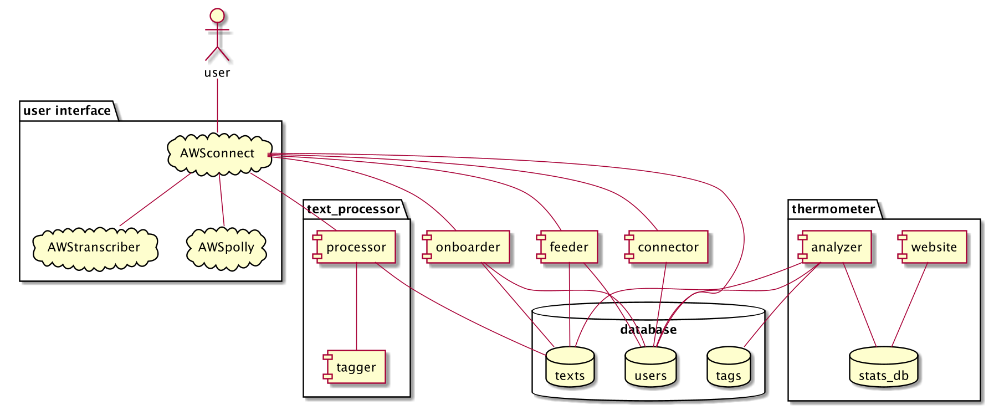

# euphonic technical docs

This is a place to keep info relevant to the developer perspective.

## Use case

## Components
Some of these we shall build; some we shall mock up; for some we shall just create an animated simulation of the user story.

### database

#### user table
- user_id: UUID
- creation_time: Timestamp
- phone_number: Long
- location: TBC
- language: String
- interest_text_id: UUID [text_id] 
- interest_tags: UUID [tag_id]
- voxicle_ids: List of UUIDs  [text_id]
- blocked: Boolean

#### text table

- text_id: UUID
- text: String
- creator: String [“user”, “internal”, “external”]
- type: String [“voxicle”, “interest_text”, “public_announcement”, …]
- creation_time: Timestamp 
- publishable: Boolean
- tags: List of UUIDs [tag_id]

#### tag table
- tag_id: UUID
- creation_time: Timestamp 
- name: String

### services

#### user interface
Chatbot/call-center application that responds to the user when the call in and funnels the user to the appropriate option (vox, connect, access). Also calls the userID service to create an entry in the user database.

#### tagging service
A microservice running on AWS that takes a text snippet of <500 words as input and outputs a list of topic tags (length of list to be specified) ranked by their relevance to the text.

#### feeder
A microservice running on AWS that takes a user id as input and returns a content item (e.g. a user post, a public information announcement, an advisory, etc.). The returned content item is the one that our system judges to be the next item most relevant to the user.

#### connector
A microservice running on AWS that takes a user id A as input and returns another user id B from the connection queue. The returned user B is the one that our system judges to be the best conversation partner match for the user A.

#### analyzer
Analyzes and aggregates vox-posts to create stats etc. for “thermometer” webpage

#### website
Displays aggregated vox-posts stats etc. E.g. trending tag heatmaps, etc.

### Diagram
This is just a sketch. Need to simplify and refine (@Animesh).

